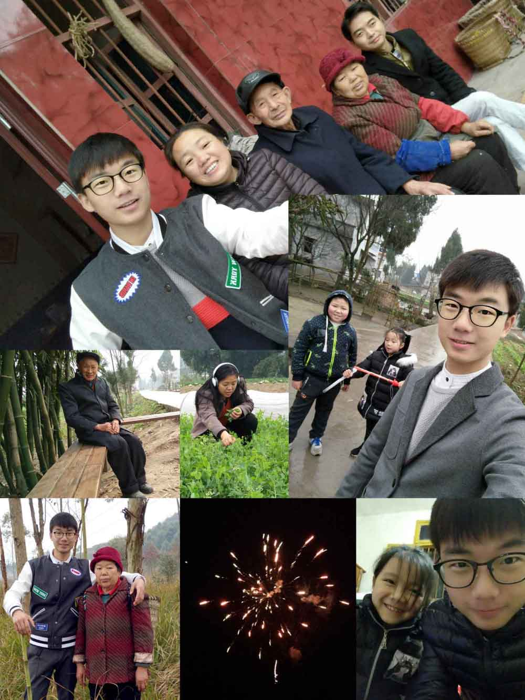
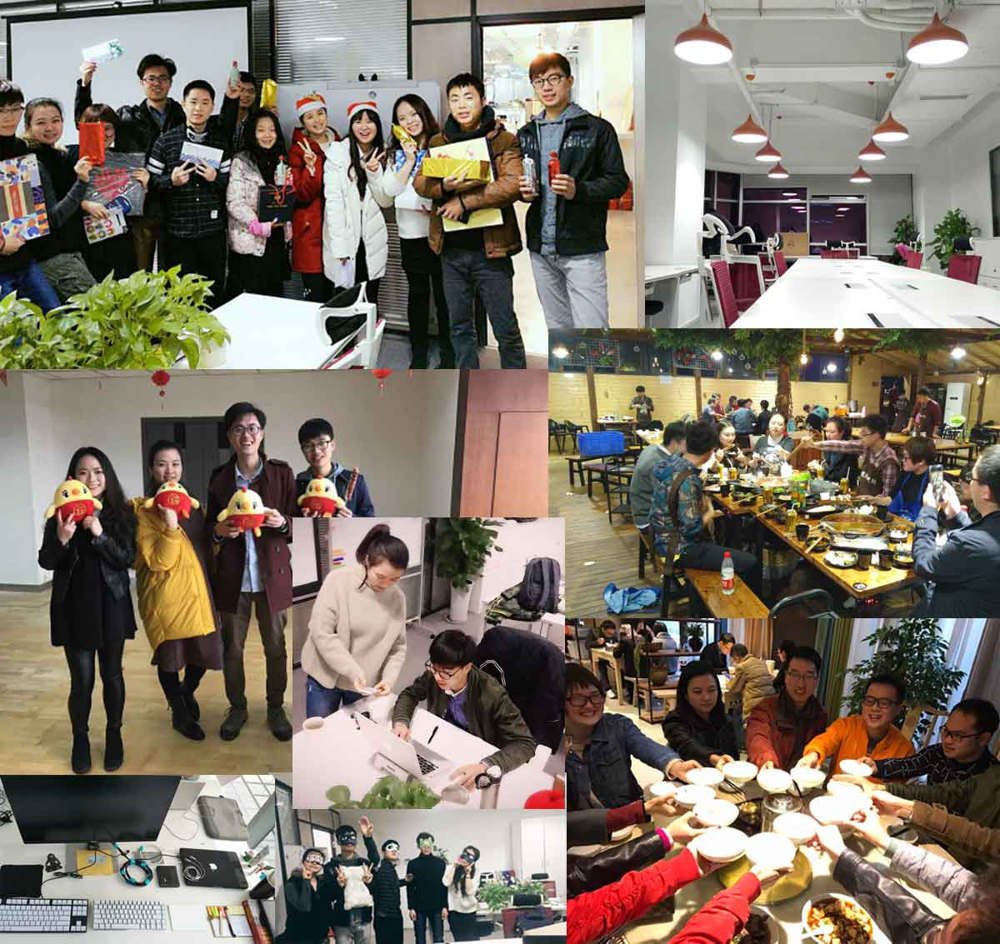
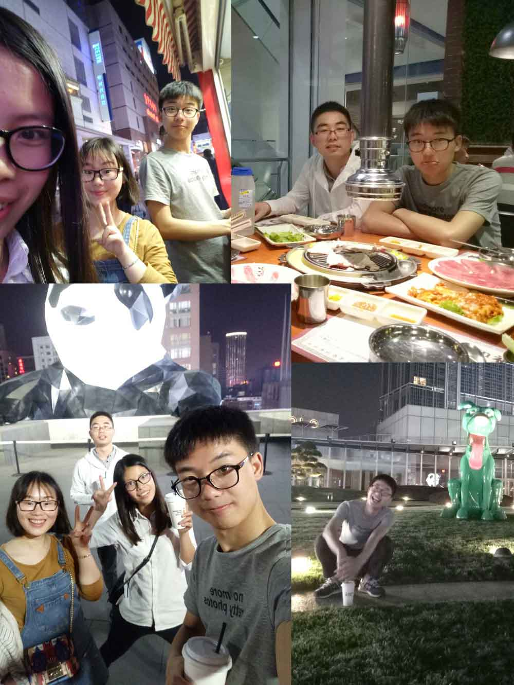
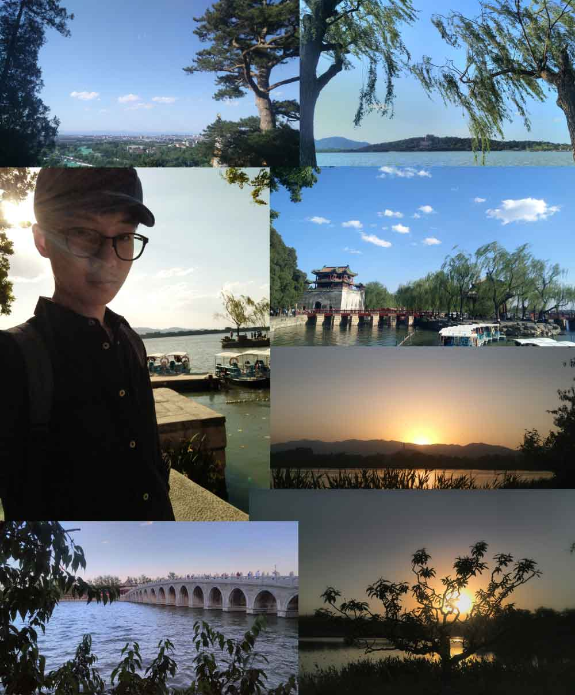

# 二零一七

> 这是一个平静年，没什么大事，就杂七杂八的日常。  
今年是 16 年毕业后的第一个完整年。  
换了两家雇主，两次跨省搬迁。  
收获了新的友情，也生疏了好多人。  
没有故意想谈个女朋友，也没有任何羡慕那些相互嘘寒问暖的情侣。  
去过一些没去过的地方，也未见过什么波澜壮阔之景色。  
没有什么成长，从 23 岁 到 24 岁了。  
学了一些热爱的、赖以生存的新技术，提高了自己。  

2 月春节放假，和亲人们一年之别的团聚。  
过了一个「照常年」，  
依旧到外婆家串门拜年，吃团年饭，包水饺，吃汤圆；看了看后山的风景，逛了逛坝上的嘉陵江。  
姐姐今年没有回家过年，爸妈老了一点，爷爷没有重病。  

春节前，我在成都「亚信数据」写前端代码挖坑。  
当时的领导告知，年后部门可能有调动。  
春节后，告别了家乡，继续上班，得知这次的公司变动是 **裁员**。  
是公司内部原因，导致很多部门被裁掉，也包括我所在部门。  
领导让我选择「N + 1」赔偿，或者换一个新部门。  
我选择去新部门，在新部门蛮舒适的，没有什么大的工作量。  
不过和我交接的前端同事都是远程办公，技术也是各种想吐槽，交流很是麻烦。  
做了几个半成品项目，还未完工就又被告知，裁员的风波并未平息，新的部门也可能会被裁掉。  
这次部门没有让我选择，公司貌似在和员工玩冷战，期望员工主动离职。  
没有具体的开发任务，「颓废」一段时间后，我主动（逼不得已）提出了离职。  

对，裸辞！没有赔偿！  
我也不知道我为什么敢裸辞，面对着城市生存的压力。  
也许是我足够自信能快速找到满意的工作并入职，也许是我对上家公司的「嘴脸」极度不满。  
提出离职那晚，正常的失眠了。  
大半夜，在小小的出租房里，看着各大招聘网站，寻找中意的雇主，像极了街边的流浪狗。  

面试过 4 家成都的雇主，拿到 3 个 offer，给的薪资在大成都还算不错的。  
有一家上海的创业公司，蛮特别的。  
只是看了我的 Github，并没有远程面试，就愿意聘请我。真是受宠若惊呢 😨！  
不过这也侧面反映了，初创公司招前端不容易。  
我简历还投过杭州的阿里、北京的知乎。  
阿里最后得到了一个「外包」岗位，我婉拒了。  
当时，还挺挫败的。因为经历过不同的大大小小的公司，选雇主我也变得谨慎了。  
成都和上海的 offer 都不是很满意。  
还有好多投的其他公司简历直接被 HR pass，简历石沉大海。  
当时最后的期望就是知乎的 offer，最后如愿以偿得到了知乎的青睐。  
在得到知乎 offer 后，就计划着我要怎么搬到北京去，要处理什么事情。  
得特别感谢 `@单文斌` 帮我搬家，帮我抬超重的行李。  

搬离成都真的很舍不得，毕竟从 14 年大二实习第一次到成都生活，也有 2 年多了。  
舍不得这边的朋友、美食，舍不得天府三街，舍不得熟悉的园区与公园…  
和亚信的一些同事约好的吃饭也没有实现。  
离开成都前一天晚上，和几个朋友一起去逛了逛春熙路，吃了一些小吃，算是对我的送别。  

在不同的城市有认识的朋友真的很重要。  
很多行李和生活用品打包，用顺丰快递寄给了在北京工作的朋友 `@伍泯渝`。  
买了一张二十小时左右的卧铺火车票，就开始「北漂」生活。  
到北京的时间刚好是周六中午，伍泯渝同学还专门在北京西站接待我，很是感谢。  
接下来便是找房子，首选「自如友家」租房平台，没有花什么精力就找到了一个「合适单间」。  
北京的房价真是贵！加上「服务费、水电、气…」每月租房就得「￥2500」，还是偏便宜的那种 😨。  
到北京当天很匆忙，下火车后，伍泯渝打车到她家吃了顿午饭，然后联系自如管家看房子，  
搬行李到新房间，整理房间…  
再次感谢 `@伍泯渝`，否则我绝对忙不过来。  

来北京前，我以为的北京是「大都市、高楼林立、雾霾超标、下雪的冬季、房价贵…」。  
入住当天就发现并不是我以为的那样。  
这里有湛蓝的天空，各种刮风，破旧的楼房「至少清河是这样」，拥挤的街道，房价的确是很贵。  
到后来入冬，再到我离开北京，也没有等到北京下雪。  

来到默认的城市，陌生的环境。第二天醒来，感觉很不一样。  
卧室的壁画不一样了，合租室友不一样了，楼下饭馆点菜不能用四川话了…  
安顿好的第二天，为了周一知乎新人报道不迟到，我先去踩点。  
隔着 1010 玻璃门看到知乎 Logo 的时候，挺亲切，仿佛在他乡找到归属感。  

说实话，我很喜欢「未知」。  
未知的地域、朋友、同事、技术、项目、风景、老板…  
我不知道上班第一天是什么感觉，我不知道谁是我的办公室同桌，  
我不知道我是否能习惯公司的食堂饭菜，我不知道我是否能担任 mentor 分发的 task。  
对于这些新的未知，我内心是向往的心态。

第一天，`@夏志远` 带我到「职人介绍所」办理相关入职手续，  
领了显示器和 Mac，不过后来都还给公司了，  
因为我从成都寄了一个 Dell 显示器，自己的 Mac 也是定制版 16G。😊  
我的工位很多灰「应该是很久没人坐了」，找旁边的 `@张伟` 接了一块「抹布」，  
后来才知道他是一个大大的 Leader。d~~(╯﹏╰)~~b  
张伟介绍了 mentor `@王雅舒`，后来又找我说搞错了，mentor 换为 `@刘佳炽`。  
后来开始各种「入职培训」，更了解了知乎的「海盗文化」，也见到了 CEO `@周源`。  
每周有 2 次技术会议，一次前端会议，一直技术部会议。  
开始几次会议，佳炽总会介绍周围后端的同事，  
认识了 `@王伟、@展昭、@杨硕…`「当然，很多同事是后来认识的…」，  
他们全都是很厉害的大神，在后来的工作中也有对我的帮助与合作。  
在前端的会议上如果有新人进来，大家都会向新人轮询的介绍。  

入职后的第一个任务是新建一个广告模板预览「一个内部 npm 包」。  
渐渐的了解了 React、webpack、redux，渐渐地熟悉相关技术，渐渐地任务完成得越来越得心应手。  
当然，我遇到很多棘手的问题，很多时候我感觉我要完了，这些问题完全搞不定啊。  
其实后来，都解决了。也没有问谁，多查查多看看，都是迎刃而解。  
再回顾那些问题，还挺开心，因为在解决问题的过程中的成长很是珍贵。  
工作方式上和在亚信的时候，有很大的改变。  
更正规的 `code review` 机制，更完善的文档系统，上线、发布流程…  

前端有个规定，周五的会议结束后必须有人技术分享「不过也有人分享见闻、旅游」  
作为新人的为被排在了前面，我准备了好几个晚上，才把我的候选「分享标题」确定。  
最开始确定的主题，被佳炽否定了，他说这些东西太简单了，换个别的。  
当时我的内心当然还蛮不开心的，直接被否定了。  
后来算是熬夜几个晚上吧，写了一个「Web Worker & Service Worker」的分享的 PPT 和 markdown。  
分享后，佳炽说还可以，蛮不错的。「所以，我还是比较虚荣的，喜欢被夸奖，不过否定能使我进步」  

渐渐的我适应了新的团队，适应了周围的同事。  
我右边的 `@肖东阳、@朱杰` 话都很少，感觉很厉害。  
佳炽作为 mentor 很认真。他会很仔细的看我的 MR 和评论，在 MR 中我也学习了很多东西。  
不过佳炽不会很仔细的回答我的「弱智提问」，  
因为那些问题真的很弱智，这也教会我遇到问题少问，多想，多查，尽量自己解决。  
公司有个 `one on one` 制度，每周固定时间和 mentor 交流一下感想，心得，心态变化，意见建议…  
后来我觉得每周的 `one on one` 太频繁了，每次我都不知道说什么，都是尬聊，  
感觉一周好像没有发生什么，就改成了二周一次 😯。

日子一天一天过，我适应北京的天气，也适应了这里的生活。  
在一个阳光明媚的周六，我决定去颐和园逛逛。这也开启了一个「小噩梦」。  
早上出发，骑着摩拜沿着北五环一路向西，几十分钟就到了圆明园。  
逛了一天，园林很漂亮，湖水很清澈，真的有古诗词描述的那种韵味。  
下午回来的时候，还是骑摩拜，我把书包放在了 **车篓** 里面，  
一遍欣赏着晚霞的美丽，一边哼着耳塞里的旋律，到小区楼下，上楼，休息，一气呵成。  

当晚睡了美美的一觉，第二天醒来洗漱后准备下楼买点做饭。  
习惯的去抽屉找钱包，咦？没有。床上？没有！床下？？没有！！  
思绪有点乱，握草，好像不止钱包不见了，我的书包呢？  
我终于发现，我绝对是把书包放摩拜车篓里面，忘了拿走 😲！  
我光速的的冲出房间，门都没来得及关，以破纪录的时间冲到楼下，发疯地寻找我昨晚锁的膜拜车。  
结局是，没有发现。  
我试过找小区监控，联系摩拜客服，询问收垃圾的大爷，在小区门口和电梯贴「寻物启事」。  
无果！卒！认栽！  
丢失书包、身份证、城市一卡通、银行卡、信用卡、现金、钱包、充电宝 💔。  
后来采取一系列补救，挂失、补办卡片，买新的书包…  
也是因为这次的马虎，在 10 月份我不得不回老家办理身份证。  

进入知乎的时候是 4 月份，平时工作不是特别忙，偶尔需求多加班。  
除了和 mentor 比较熟悉，上班几乎没有同事之间的交流。  
某天在 slack 上有人陌生人问我前端问题，应该是个后端同事吧。  
话说，当时前端紧缺，好多后端项目都是后端人员自己在维护界面，真提他们「心累」。  
恩，就是 `@翟猛` 老师，他算是在知乎认识的第一个朋友吧，指导一些前端问题，一来二去就熟悉了。  
5 月份的时候我的生日，我还期待公司有什么「生日奖励」呢，是我想多了！  
当时想出去吃点好的，毕竟食堂，恩，至少不适合生日当天吃。  
如果在成都，应该可以喊上几个老朋友一起聚聚，不过在北京，没有什么朋友。  
所以就约了翟梦老师一起吃个火锅！(⊙o⊙)…  
后来陆陆续续和 `@俊哲、@朱杰` 老师熟悉一些。  
也算是不那么「孤单」，午餐、晚餐也有人聊个天什么的…  

年中的时候，公司组织了一个「年中活动」，是毕业以来第一次经历比较大型完整的公司活动了吧。  
当时住了「豪华」的五星级酒店，还很二哈的和同事说「好感动，以前都没有住过这么贵的酒店」🙄。  
整个活动 3 天，还是在工作日，加上周末一共休息了 5 天。恩，很是安逸。  
大型团队游戏什么的，在以前的公司也没有体验过，也算是很多个第一次就没有了 😆。  
印象比较深的是，朱老师弹吉他很厉害、我们团队活动排名第一、`@彭福伟` 唱歌很好听…  

由于去颐和园丢了书包，所以 10 月份不得不回老家办理。  
本来说在北京能异地办理外地身份证。  
然后去过清河派出所问才知道，我得有居住证才可以，而居住证需要身份证办理。MDZZ~~  
回家后，除了办理身份证。还去看望了外婆，吧爷爷、幺爷爷从南充带到成都游玩了一周。  
带他们去爬了青城山、带他们去吃没有吃过的西餐、带他们坐缆车、带他们看了成都的特色景点…  
这也是第一次，和两位爷爷出去游玩吧，我能感觉到他们的开心。  

快乐的时间过得很快，国庆后还得回来上班 🤣。  
记得商业需要开发好多新的系统，人员不够，招聘也来不及。  
所以，被领导安排「封闭开发」，和俊哲、朱杰、翟猛……等人，在 1 个多月开发了 3 个后台系统。  
当然我只是写了很少的代码，我是挖坑的 🤡，项目前端架子俊哲都是搭建的 💪。  
那段时间，必须 10 点上班，10 点下班，严格打卡，否则迟到红包 200 起步。「平时可是弹性制度」  
不过，那段封闭开发我反而觉得很充实。  
当时，还和俊哲约定，我们 10 点下班后去健身房，11 点后打车回家，周围的小伙伴都惊呆了。  
当时的约定是，谁不去就发 100 红包 😏。  
倒也是奇怪，那段时间几乎没有额外的休息时间，项目匆忙，还挺充实，每天都还蛮期待的。  
后来因为这次的「封闭开发」还额外得了一笔奖金 🤑。  

冬天到了！  
我不得不放弃自行车，改为公交车，否则真的会冻成狗！  
上班路边的树，768 园区的树都成了枝丫~~~  
今天北京没有下雪，太干燥。  

这些「颓废」的景象就像是暗示着什么要发生。  
还真的发生了。某天，接到阿里电话，对，是一个面试邀约电话。  
也只是抱着试一试的态度，没有考虑要离开知乎，应为我觉得我应该面不上 😮。  
但是最后还面成了，恩，这是惊吓。  
整个过程前后经历了快 2 个月。
我也在思考，工作是为了什么，在哪里工作又以为着什么。  
导致有好多天，我失眠，翻来覆去睡不着，最后还是决定离开这里，是以舍不得的心态离开的。  
舍不得这里的一些朋友，舍不得写的代码，舍不得还没有看过得风景，甚至舍不得上班的公交车。  

18 年 1 月的时候，我告诉了 Leader 我的决定。  

- 北京人印象
- 学习了什么
- 新的朋友
- 新的团队
- 我要离开北京了
- 和自如的清洁阿姨聊天的感想
- 出去玩了 2 天
- 商业走了一些人
- 滑雪
- 退群
- 很多记不住，没有什么好记住的
- 没有联系的朋友们
- 寄快递「太忙了」
- 再见，公交，B座，冷风，空档的房间
